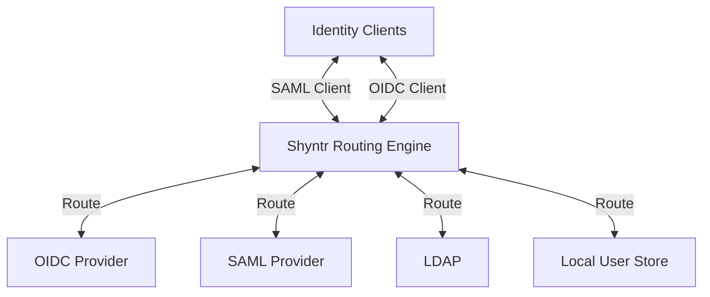
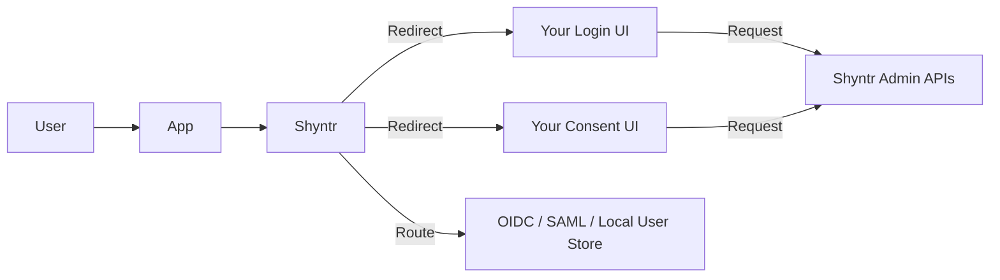
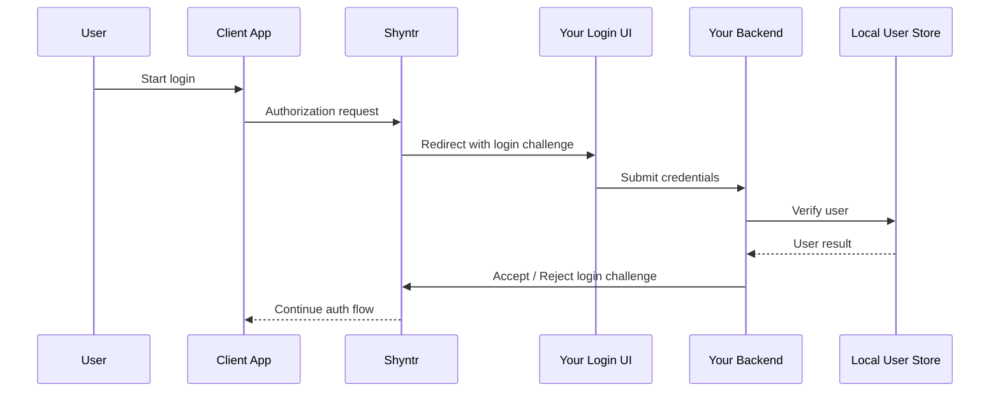
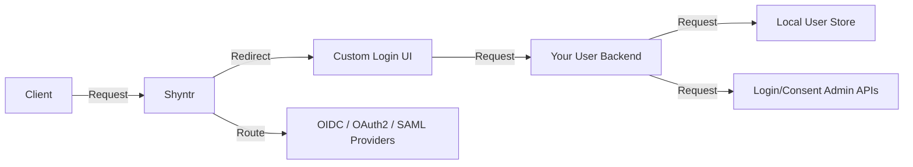
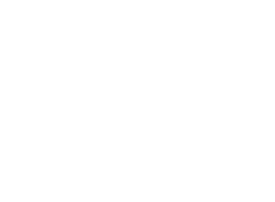

<p align="center">
  
  <br>
  <i>Shyntr - The Identity Router</i>
</p>

## 🚀 The Identity Protocol Router for Modern Infrastructure

Shyntr is not just a protocol bridge.

It is a **bi-directional identity routing mesh** that connects clients, identity providers, directories, and custom user systems across different protocols — while also letting you keep full control over your own login and consent experience.

Shyntr is designed for:

* Protocol Translation
* Identity Federation
* Externalized Login & Consent UI
* Admin API Driven Identity Control
* Custom User System Integration
* Zero-Trust Token Infrastructure
* Multi-Tenant Identity Routing

---

## ⚠️ The Identity Chaos Problem

Modern infrastructure suffers from **identity fragmentation**.

Different systems rely on incompatible authentication standards:

* SAML (Legacy Enterprise Systems)
* OpenID Connect (Modern Applications)
* OAuth2 (APIs And Microservices)
* LDAP (Corporate Directories)

Connecting these systems often requires:

* Rewriting Authentication Flows
* Deploying Multiple IAM Solutions
* Complex Federation Setups

This results in operational complexity and security risk.

---

## 🧭 Meet Shyntr — The Identity Router

Shyntr sits between applications and identity providers and **routes authentication flows across protocols**.

```mermaid
flowchart LR
    Application --> Shyntr
    Shyntr --> IdentityProvider
    IdentityProvider --> LDAP
    IdentityProvider --> SAML
    IdentityProvider --> OIDC
    IdentityProvider --> OAuth2
````

Instead of rewriting authentication logic, Shyntr translates identity flows between protocols.

Example protocol bridges:

* SAML -> OIDC
* LDAP -> OIDC
* OIDC -> SAML
* OIDC -> LDAP

---

## 🔀 Identity Routing Mesh

Shyntr creates a routing mesh between:

* SAML
* OpenID Connect (OIDC)
* OAuth2 APIs
* LDAP *(Soon)*
* Local / Custom User Store

Instead of building one-off bridges, Shyntr enables **any-to-any routing** between identity clients and identity sources.

```mermaid
flowchart LR
    SAML[SAML]
    OIDC[OpenID Connect]
    LDAP[LDAP]
    LOCAL[Local User Store]

    SAML <-->|Route| OIDC
    OIDC <-->|Route| SAML
    SAML -->|Route| LDAP
    SAML -->|Route| LOCAL
    OIDC -->|Route| LDAP
    OIDC -->|Route| LOCAL
```

This is not a static bridge model.

It is a **policy-driven routing model** where Shyntr evaluates:

* Client Protocol
* Tenant Context
* Routing Rules
* Target Identity Source

---

## 🔁 Any-to-Any Identity Routing

Shyntr can route authentication requests between different client and provider combinations.

Examples include:

* SAML Client -> OIDC Provider
* OIDC Client -> SAML Provider
* SAML Client -> SAML Provider
* SAML Client -> LDAP *(Soon)*
* OIDC Client -> LDAP *(Soon)*
* OIDC Client -> Local User Store
* SAML Client -> Local User Store
* OIDC Client -> OAuth2 Resource Server



This gives you a unified identity layer without forcing every system to speak the same protocol.

---

## 🖥️ Externalized Login and Consent

Shyntr separates **identity flow orchestration** from **user interface rendering**.

That means you can build and own your own:

* Login Page
* Consent Page
* User Journey
* Brand Experience
* Custom Authentication UX

while Shyntr handles:

* Login Challenges
* Consent Challenges
* Flow Continuation
* Redirect Orchestration
* Token Issuance
* Protocol Translation
* Trust Boundaries



---

## 🔐 Custom Login UI Flow

Shyntr can redirect authentication requests to external UI endpoints that you control.

Typical model:

1. Client Starts Authorization Flow
2. Shyntr Creates Login Challenge
3. User Redirected To Your Login UI
4. UI Fetches Login Request
5. Backend Verifies User
6. Backend Accepts / Rejects Challenge
7. Shyntr Continues Flow



---

## 🧩 Local User Store as a First-Class Identity Source

Shyntr does not require every user to live inside the identity router itself.

Your own domain-specific user system can remain authoritative.

Examples:

* Internal User Database
* HR-Driven User Lifecycle
* School Systems With Role Models
* SaaS Membership Systems
* Admin-Managed Local Accounts



**Your Application Owns The Users,
Shyntr Owns The Identity Routing Layer.**

---

## 🏗️ Control Plane and Routing Plane

### 🧠 Control Plane

* Tenants
* Scopes
* OIDC Clients
* SAML Clients
* OIDC Connections
* SAML Connections
* Routing Configuration

### ⚡ Routing Plane

* Authorization Flows
* Login Orchestration
* Consent Orchestration
* Protocol Translation
* Token Issuance
* Claim Transformation
* Trust Enforcement

This is why Shyntr should be understood not as a simple bridge, but as an **identity routing and orchestration platform**.

### 🔐 Trust Enforcement Layer

Shyntr enforces trust boundaries not only at the identity protocol level, but also at the **network interaction layer**.

Security-sensitive outbound HTTP requests initiated by Shyntr (such as:

* Webhook delivery
* OIDC discovery
* SAML metadata retrieval

) are evaluated through a **policy-driven outbound control mechanism**.

This ensures that:

* Identity flows cannot trigger arbitrary network calls
* Internal infrastructure is never exposed via outbound requests
* All integrations respect tenant-level trust boundaries

Outbound behavior is governed by:

* Tenant-specific policies
* Global fallback policy
* Strict default deny posture

This makes Shyntr a **Zero Trust Identity Router**, not just at the protocol level, but across system boundaries.

A default global outbound policy is provisioned during migration, ensuring that outbound security remains enforced even before tenant-specific policies are configured.

---

## 🎯 Why This Architecture Matters

Traditional IAM systems force you to:

* Couple Identity UI With Engine
* Duplicate User Logic
* Build Protocol-Specific Integrations
* Hard-Code Trust Paths

Shyntr avoids that.

With Shyntr:

* Your UI Remains Yours
* Your User System Remains Yours
* Routing Stays Protocol-Agnostic
* Identity Flows Stay Standards-Driven
* Trust Is Centralized

---

## 🌍 Real-World Positioning

Shyntr is ideal when you need to:

* Connect SAML And OIDC Ecosystems
* Expose Custom Users Through Standard Flows
* Keep Full Control Over Login UX
* Manage Identity Clients Centrally
* Build Multi-Tenant IAM Platforms
* Add Federation Without Replacing Your Core System

---

## 📚 Documentation

[Shyntr Documentation Website](https://docs.shyntr.com)

* Configuration Guide
* CLI Reference Guide

---

## 🤝 Contributing

* Open Issues
* Submit Pull Requests
* Improve Documentation
* Share Feedback

---

## 📄 License

Shyntr is proudly open-source and licensed under the **Apache-2.0** license. Check the `LICENSE` file for details.

---

<div>
  <a href="https://buymeacoffee.com/nevzatcirak17" target="_blank">
    
  </a>
  <a href="https://nevzatcirak.com" target="_blank">
    
  </a>
</div>
<br clear="all">
